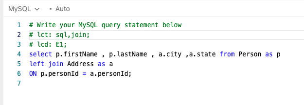

# Leet-Classifier


**Leet-Classifier** is a Python-based open-source tool designed to streamline the process of classifying and organizing your LeetCode submissions. It extracts essential metadata from comments, such as tags (in the format of lct:tag1,tag2;) and difficulty tags (lct:E1;), from your most recent LeetCode submissions. With this information, Leet-Classifier intelligently classifies your submissions into well-structured folders on your local system. This will help you review the solved problems for interviews and identify patterns.

## Prerequisites

Before you get started with **Leet-Classifier**, ensure you have the following prerequisites:

- Python 3.x installed on your system.

## Get Started

You can clone the repository to your local machine and set up the project using the following commands:

1. Clone the repository:

```bash
git clone https://github.com/gopikrsmscs/leet-classifier.git
```
2. Change the working directory to the project folder:

```bash
cd leet-classifier
```
3. To use leet-classifier, you need to configure it with your LeetCode cookie. Here's how you can do it:
Inside cookie.json, add your LeetCode cookie as follows:
```json
{
    "Cookie": "your_leetcode_cookie_here"
}
```
Ensure that you replace "your_leetcode_cookie_here" with your actual LeetCode cookie. You can obtain your LeetCode cookie by inspecting your browser's developer tools while logged in to LeetCode.

## Usage
To make use of the Leet-Classifier, add tags anywhere in the code as comments before making submissions to LeetCode. Below are examples of supported tags:

### Supported Tags
- **Problem Tag (lct)**: Write in comments anywhere in the code, starting with lct and ending with a semicolon (;).
    ``` bash
    lct:tag1,tag2; 
    lct:tag1;
    ```
- **Difficulty Tag (lcd)**: Write in comments anywhere in the code, starting with lcd and ending with a semicolon (;). The lcd field is not mandatory. 
    ``` bash
    lcd:e1; 
    lcd:e2; 
    lcd:m1; 
    lcd:h1;
    ```
### Example Usesage



### Run the script

```bash
python leet_classifier.py
```

## Contributing
We welcome contributions to make this project even better. If you have suggestions, bug reports, or feature requests, please follow these steps:

Open an issue to discuss your ideas or report a problem.
Create a pull request if you'd like to contribute code improvements.
Your contributions will help the leet-classifier to enhance experience.

## Acknowledgments
If you find this project useful, please consider giving it a star. Your support encourages further development and helps other leetcode entuasists discover this tool.

## License
This project is licensed under the MIT License. For more details, please refer to the LICENSE file in this repository.


